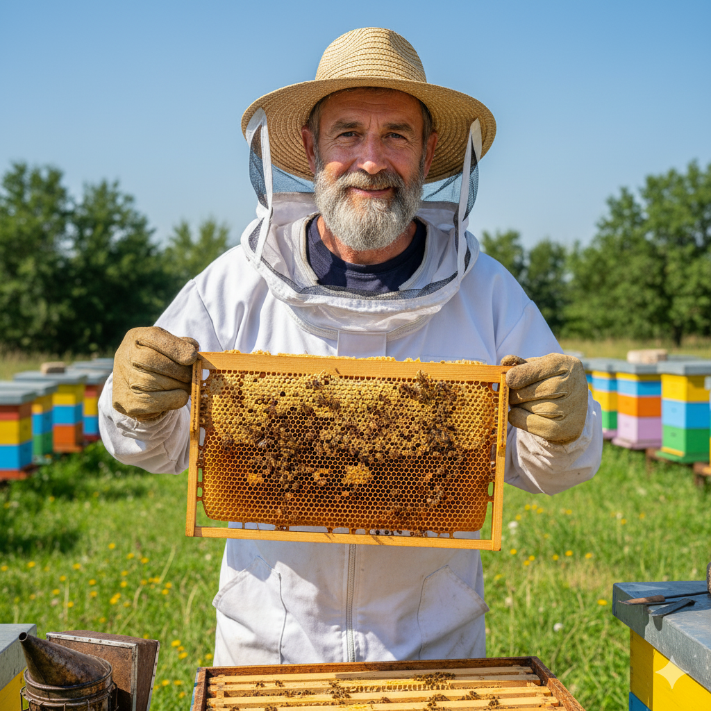
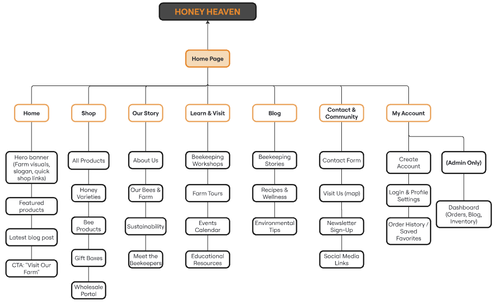

# 🍯 Honey Heaven – User Personas

You can download the file here:
<a href=".user-personas-&-info-architecture.pdf">Download the file.</a>  
You can read the file here: <a href="https://fesb-my.sharepoint.com/:b:/g/personal/ibaric01_fesb_hr/EVTEMWbwnytNkyk6ETy3eTwBpY3Cz_TLUPtlrjVExz4Cpw?e=WeoMc2">Read the file.</a>

---

## 👩‍🍳 Persona 1: Ana Tolić

**Age:** 33  
**Location:** Split, Croatia  
**Occupation:** Nutritionist & Health Blogger  
**Tech Comfort:** High  

### Overview  
Ana is a health-focused nutritionist and blogger who promotes local, natural foods. She’s always searching for authentic Croatian producers and stories to share with her readers.  

### Goals  
- Discover local honey producers she can trust  
- Learn about beekeeping and sustainability  
- Purchase raw honey and natural products online  

### Motivations  
Transparency, wellness, authentic storytelling.  

### Pain Points  
- Hard to find trustworthy small-scale producers online  
- Dislikes commercial, impersonal websites   

---

## 👨‍🍳 Persona 2: Marko Radić

**Age:** 46  
**Location:** Šibenik, Croatia  
**Occupation:** Café Owner & Pastry Chef  
**Tech Comfort:** Medium  

### Overview  
Marko runs a café that focuses on local, high-quality ingredients. He values consistency and direct relationships with suppliers.  

### Goals  
- Find reliable honey suppliers for café use  
- Explore wholesale and delivery options  
- Support local farmers  

### Motivations  
Quality sourcing, simplicity, local collaboration.  

### Pain Points  
- Few easy online wholesale options  
- Limited product transparency    

---

## 👩‍🏫 Persona 3: Petra Banić

**Age:** 26  
**Location:** Zadar, Croatia  
**Occupation:** Primary School Teacher  
**Tech Comfort:** High  

### Overview  
Petra is a young teacher passionate about sustainability and nature. She’s eager to learn and participate in eco-friendly workshops.  

### Goals  
- Attend beekeeping workshops or tours  
- Buy handmade eco-products and gifts  
- Read about bees and nature  

### Motivations  
Learning, experience, environmental awareness.  

### Pain Points  
- Difficult to find well-organized workshops  
- Wants a simple mobile-friendly booking process  

---

## 🐝 Persona 4: Josip Marić

**Age:** 41  
**Location:** Unešić, Croatia  
**Occupation:** Beekeeper & Owner of Honey Heaven Farm  
**Tech Comfort:** Medium  

### Overview  
Josip is the beekeeper behind Honey Heaven. He balances farm work, family life, and digital promotion. His goal is to educate others about bees and connect with his customers online.  

### Goals  
- Promote his products and tell the Honey Heaven story  
- Educate the community about bees and sustainability  
- Manage online orders and blog updates  

### Motivations  
Connection, authenticity, education, and growth.  

### Pain Points  
- Limited time for digital marketing  
- Reaching urban and younger audiences  

---

## 🧩 Persona Summary Table

| Persona | Age | Occupation | Location | Primary Goal | Tech Comfort | Key Motivations |
|----------|-----|-------------|-----------|---------------|---------------|------------------|
| **Ana Tolić** | 33 | Nutritionist & Blogger | Split | Discover authentic local honey and stories | High | Transparency, wellness, storytelling |
| **Marko Radić** | 46 | Café Owner & Pastry Chef | Šibenik | Reliable local honey supplier for café use | Medium | Quality sourcing, simplicity |
| **Petra Banić** | 26 | Teacher | Zadar | Join workshops and support eco products | High | Experience, sustainability |
| **Jospi Marić** | 41 | Beekeeper & Farm Owner | Unešić | Grow brand, educate customers, and share his story | Medium | Connection, authenticity, education |

---

## Sitemap:

---

© 2025 Honey Heaven Project – Designed for educational and business development purposes.
